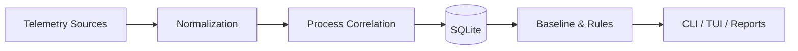

<div align="center">
  

  <h1>PortSentinel</h1>
  <p><b>See which Windows processes are talking to the network.</b></p>

  <p>
    <a href="README_RU.md">Русская версия</a> ·
    <a href="docs/ARCHITECTURE.md">Architecture</a> ·
    <a href="docs/COMMANDS.md">Commands</a> ·
    <a href="docs/ROADMAP.md">Roadmap</a>
  </p>
</div>

> [!IMPORTANT]
> **Project status:** early design stage. This repository currently contains the product architecture and documentation; no executable release is available yet.

## What is PortSentinel?

PortSentinel is a planned Windows CLI and interactive TUI for monitoring TCP/UDP activity, mapping connections and listeners to processes, storing session history, detecting baseline deviations, and producing explainable network findings.

It is not an antivirus, EDR, packet-content sniffer, remote-control system, or a guarantee of malware detection.

## Planned features

- TCP and UDP monitoring with IPv4/IPv6 support;
- PID-safe process identity and executable metadata;
- digital signature verification and optional SHA-256 hashing;
- SQLite session history and baseline comparison;
- explainable severity and confidence scoring;
- read-only Windows Firewall correlation by default;
- managed Firewall plans, dry-run, confirmation, and rollback;
- console, JSON, Markdown, and self-contained HTML reports;
- privacy modes with no payload collection.

## Planned quick start

```powershell
portsentinel doctor
portsentinel live
portsentinel listeners
portsentinel quickscan
```

These commands describe the target CLI contract and are not yet a claim of implemented functionality.

## Architecture



See [the architecture document](docs/ARCHITECTURE.md) and the detailed [Russian README](README_RU.md).

## Safety principles

PortSentinel is read-only by default. Any system-changing action must show a plan, support dry-run, require explicit confirmation, use minimal privileges, create an audit record, support rollback, and touch only PortSentinel-managed objects.

## Limitations

Polling can miss short-lived connections. UDP may not expose a remote endpoint. ETW and protected-process metadata can require elevated privileges. Reverse DNS can be ambiguous. Signed does not mean safe; unsigned does not mean malicious. PortSentinel does not inspect payloads or decrypt TLS.

## License

A license has not been selected yet. Until a `LICENSE` file is added, do not assume that the repository is distributed under a particular open-source license.
