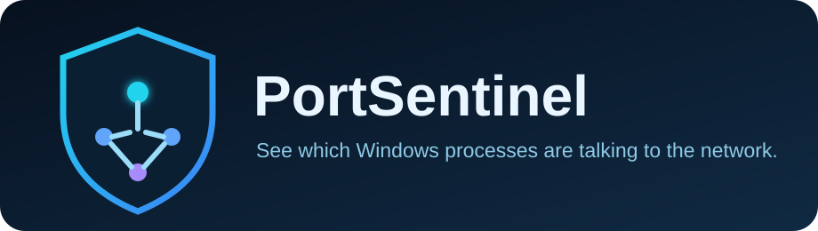

<div align="center">



# PortSentinel 🛡️

[](docs/COMPATIBILITY.md)
[](src/PortSentinel/PortSentinel.csproj)
[](VERSION)
[](LICENSE)

**Полноэкранная Windows TUI для сетевых snapshots, ETW-событий, локальной истории и объяснимого анализа.**

[English](docs/README_EN.md) · [Интерфейс](docs/INTERFACE.md) · [Архитектура](docs/ARCHITECTURE.md) · [Обновления](docs/UPDATES.md) · [Roadmap](docs/ROADMAP.md)

</div>

> [!IMPORTANT]
> PortSentinel — самостоятельный `portsentinel.exe`, а не оболочка над `netstat` или набор PowerShell-команд.

## Что нового в 0.5.2 🗄️

- добавлена верхнеуровневая панель **Telemetry Archive**;
- ETW и snapshot fallback captures автоматически сохраняются в SQLite;
- доступна история последних capture-сессий с backend status и counters;
- сохранённые события можно открывать и экспортировать в JSON/Markdown;
- Capture Comparison сравнивает две последние записи по lifecycle fingerprint без PID;
- показываются новые и исчезнувшие lifecycle events;
- telemetry diff экспортируется в JSON и Markdown;
- полный ETW Control Center v0.5.1 сохранён во вложенной панели.

## Основные возможности ✨

| Модуль | Что делает |
|---|---|
| 🗄️ Telemetry Archive | Сохраняет ETW/fallback captures и открывает историю |
| ⇄ Capture Comparison | Сравнивает две последние capture-сессии без зависимости от PID |
| ⚡ ETW Network Capture | Получает kernel TCP lifecycle events без packet payload |
| 🛟 Snapshot Fallback | Продолжает работу через Windows IP Helper API без ETW |
| 👁️ Application Watch | Строит timeline процесса и ищет reconnect loops |
| 🌐 DNS Correlation | Выполняет ограниченный reverse DNS с timeout и кэшем |
| 🌳 Network Process Tree | Показывает родительские процессы через Toolhelp32 |
| 🎯 Baseline & Rules | Показывает deviations, evidence и limitations |
| 🔐 Executable Enrichment | Рассчитывает SHA-256 и читает Authenticode metadata |
| 🔄 Update Center | Проверяет GitHub Releases, ZIP и SHA-256 |

## Telemetry Archive

1. Откройте **Capture & Archive**.
2. PortSentinel выполнит 12-секундный kernel ETW capture или безопасный snapshot fallback.
3. Capture и его события будут транзакционно сохранены в SQLite.
4. В **Telemetry History** можно открыть запись и экспортировать её.
5. **Capture Comparison** сравнивает две последние записи по стабильному lifecycle fingerprint.

Fingerprint включает event kind, protocol, endpoints и process name, но не PID. Поэтому перезапуск процесса сам по себе не создаёт ложный diff.

## ETW и fallback

Kernel ETW control обычно требует запуска от администратора. PortSentinel не изменяет системные настройки или группы доступа. Если права отсутствуют, logger занят или backend возвращает ошибку, программа использует Windows IP Helper API snapshot.

## Privacy boundary

PortSentinel не собирает и не сохраняет packet payload, HTTP body, cookies, credentials, tokens или расшифрованное TLS-содержимое. ETW events, endpoints, DNS names и lifecycle diff являются диагностическими metadata, а не malware verdict.

## Быстрый старт ⚡

1. Откройте раздел **Releases**.
2. Скачайте `PortSentinel-0.5.2-win-x64.zip`.
3. Сверьте архив с `PortSentinel-0.5.2-win-x64.zip.sha256`.
4. Полностью распакуйте ZIP в отдельную папку.
5. Запустите `portsentinel.exe`.

Не запускайте программу непосредственно из ZIP: встроенному обновлению нужна обычная папка с правом записи.

## Управление 🎮

| Клавиша | Действие |
|---|---|
| `↑` / `↓` | Выбор пункта, capture или события |
| `W` / `S` | Альтернативная навигация в главном меню |
| `Enter` | Открыть экран или карточку события |
| `R` | Повторить capture или обновить history |
| `J` / `M` | Экспорт JSON / Markdown |
| `X` | Показать исчезнувшие fingerprints в comparison |
| `Esc` / `Q` | Назад или выход |

## Локальное хранилище

```text
%LocalAppData%\PortSentinel\portsentinel.db
%LocalAppData%\PortSentinel\reports
```

SQLite использует WAL. Версия 0.5.2 добавляет таблицы `telemetry_captures` и `telemetry_events` без изменения существующих sessions и baselines.

## Командные параметры

```powershell
portsentinel.exe --version
portsentinel.exe --check-update
portsentinel.exe --no-animation
portsentinel.exe --help
```

## Сборка из исходников 🛠️

```powershell
git clone https://github.com/Onmaynec/PortSentinel.git
cd PortSentinel
dotnet build PortSentinel.sln -c Release
dotnet run --project src/PortSentinel/PortSentinel.csproj
```

Portable EXE:

```powershell
dotnet publish src/PortSentinel/PortSentinel.csproj `
  -c Release -r win-x64 --self-contained true `
  -p:PublishSingleFile=true `
  -p:IncludeNativeLibrariesForSelfExtract=true
```

## Roadmap 🗺️

- `0.5.x` — IPv6/UDP ETW coverage, failure classification, capture duration и tests;
- `0.6.0` — read-only Firewall correlation и безопасные managed rules;
- `1.0.0` — стабильные schemas, подписанные релизы и backward compatibility.

## Автор

**Onmaynec** — [@Onmaynec](https://github.com/Onmaynec)

---

**PortSentinel 0.5.2** · Windows 10/11 x64 · .NET 8 · MIT
