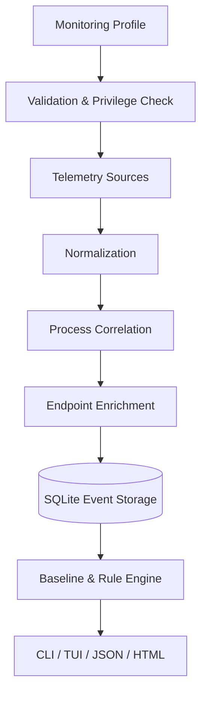

<div align="center">
  

  <h1>PortSentinel</h1>
  <p><b>Узнай, какие процессы Windows используют сеть.</b></p>

  <p>
    <a href="README.md">English</a> ·
    <a href="docs/ARCHITECTURE.md">Архитектура</a> ·
    <a href="docs/COMMANDS.md">Команды</a> ·
    <a href="docs/ROADMAP.md">Roadmap</a> ·
    <a href="SECURITY.md">Безопасность</a>
  </p>
</div>

> [!IMPORTANT]
> **Статус:** ранняя стадия проектирования. Репозиторий содержит архитектуру и документацию будущего продукта; исполняемая версия ещё не опубликована.

## 🛡️ Что такое PortSentinel

**PortSentinel** — проект консольного инструмента и интерактивного TUI-монитора для Windows 10/11 x64. Он должен показывать, какие процессы открывают порты и сетевые соединения, сохранять историю наблюдений, сравнивать активность с baseline и формировать понятные findings с доказательствами и ограничениями.

Проект объединяет задачи, для которых обычно приходится открывать `netstat`, Resource Monitor, TCPView, PowerShell, Windows Firewall, Event Viewer и Process Explorer.

PortSentinel **не является** антивирусом, EDR, анализатором сетевого содержимого или гарантией обнаружения вредоносного ПО.

## ✨ Основные возможности

| Возможность | Что будет показываться |
|---|---|
| 🔌 TCP/UDP-мониторинг | Активные соединения, listeners, состояния TCP, IPv4 и IPv6 |
| 🧩 Связь с процессами | PID, родительский процесс, путь, издатель, подпись и версия файла |
| 📚 История сессий | Сохранение событий и findings в SQLite |
| 📏 Baseline | Сравнение текущего поведения с нормальной активностью компьютера |
| 🔍 Explainable findings | Severity, confidence, причины, доказательства, ограничения и рекомендации |
| 🧱 Firewall integration | План изменений, dry-run, подтверждение и rollback только managed-правил |
| 📊 Отчёты | Console, JSON, Markdown и автономный HTML без CDN |
| 🔒 Privacy modes | Redaction путей, DNS и персональных данных; payload никогда не собирается |

## 🚀 Проектируемый Quick Start

После появления первого релиза базовый сценарий будет выглядеть так:

```powershell
portsentinel doctor
portsentinel live
portsentinel listeners
portsentinel quickscan
```

Наблюдение за отдельным приложением:

```powershell
portsentinel watch process Discord.exe
portsentinel launch .\Application.exe --arg "--test"
```

Создание и сравнение baseline:

```powershell
portsentinel baseline create normal-workstation --duration 10m
portsentinel baseline compare normal-workstation
```

> [!NOTE]
> Команды выше описывают целевой CLI-контракт и пока не являются подтверждением готовой реализации.

## 🖥️ Как будет выглядеть live-монитор

```text
┌ PORTSENTINEL LIVE ─────────────────────────────────────────────────────────┐
│ PROCESS             PID    PROTO  LOCAL                 REMOTE              │
├─────────────────────────────────────────────────────────────────────────────┤
│ Discord.exe         8420   TCP    192.168.1.4:52144     discord.com:443     │
│ steam.exe           6512   UDP    0.0.0.0:27036         -                   │
│ code.exe            9128   TCP    127.0.0.1:5173        LISTENING           │
│ unknown-tool.exe   10440   TCP    0.0.0.0:8080          LISTENING           │
└─────────────────────────────────────────────────────────────────────────────┘
```

Цветовая схема планируется в стиле dark terminal: cyan/blue для интерфейса, green для нормальной активности, yellow/orange для проверки и нового поведения, red для ошибок, purple для baseline deviations.

## 🧠 Как PortSentinel будет объяснять риски

Вместо категоричного «это вирус» finding должен описывать наблюдаемые факты:

```text
HIGH — New externally reachable listener

Process: ExampleServer.exe
Endpoint: 0.0.0.0:8080

Evidence:
- listener привязан ко всем IPv4-интерфейсам;
- процесс не имеет цифровой подписи;
- executable расположен во временной директории;
- listener отсутствует в выбранном baseline.

Confidence: 91%
```

Формулировки: `unusual`, `potentially risky`, `requires review`, `new compared with baseline`, `unsigned`, `unexpected listener`. Даже уровень `Critical` не является malware verdict.

## 🏗️ Архитектура



Ключевые слои:

- `PortSentinel.Domain` — события, endpoints, процессы, connections, findings и baselines;
- `PortSentinel.Core` — lifecycle сессий, correlation, privacy, baseline и rule engines;
- `PortSentinel.Windows` — IP Helper API, WinTrust, Firewall, ETW и native wrappers;
- `PortSentinel.Sources` — источники TCP, UDP, процессов, DNS, интерфейсов и Event Log;
- `PortSentinel.Storage` — SQLite, migrations, batching и paging;
- `PortSentinel.Reporting` — console/HTML/JSON/Markdown;
- `PortSentinel.Cli` — команды, TUI, фильтры и стабильные exit codes.

Подробнее: [docs/ARCHITECTURE.md](docs/ARCHITECTURE.md).

## 🔐 Безопасность по умолчанию

PortSentinel проектируется в режиме **read-only по умолчанию**. Системные изменения должны выполняться только отдельной командой и обязательно включать:

1. понятный план;
2. `--dry-run`;
3. явное подтверждение;
4. минимально необходимые права;
5. журналирование операции;
6. rollback;
7. изменение только объектов, созданных PortSentinel.

Автоматическая блокировка процессов не допускается. Сторонние Firewall rules не изменяются и не удаляются.

## 🔏 Приватность

Проект не должен собирать payload, HTTP body, TLS content, cookies, токены, пароли или содержимое файлов. Полные command lines отключены по умолчанию.

Планируемые режимы:

- **Balanced** — скрывает пользователя и имя компьютера, редактирует профильные пути, сохраняет registrable domain;
- **Strict** — хеширует или скрывает DNS, редактирует публичные IP и host paths;
- **Custom** — позволяет явно выбирать сохраняемые поля.

Подробнее: [docs/PRIVACY.md](docs/PRIVACY.md).

## ⚠️ Честные ограничения

- polling может пропускать очень короткие соединения;
- у UDP не всегда существует доступный remote endpoint;
- ETW и некоторые Event Logs могут требовать права администратора;
- protected processes предоставляют ограниченные metadata;
- PID переиспользуются системой и не подходят как долговременная identity;
- reverse DNS и связь домена с конкретным connection могут быть неточными;
- цифровая подпись не гарантирует безопасность, а отсутствие подписи не доказывает вредоносность;
- необычный порт не является доказательством угрозы;
- содержимое трафика и TLS не анализируются;
- Firewall rule может нарушить работу приложения;
- baseline зависит от условий наблюдения и меняется после обновлений.

## 🗺️ План развития

| Версия | Основной результат |
|---|---|
| `0.1.0` | TCP/UDP, process mapping, listeners, sessions, SQLite, baseline, базовые rules, reports и managed Firewall rules |
| `0.2.0` | ETW, DNS, process tree, installer mode, failures и timeline |
| `0.3.0` | Offline enrichment, сравнение сессий, custom rule packs и расширенные графики |
| `0.4.0` | Source SDK, Rule SDK, плагины, подписанные rule packs и bundles |
| `1.0.0` | Стабильные API/схемы, signed releases, проверенный rollback и backward compatibility |

Полная версия: [docs/ROADMAP.md](docs/ROADMAP.md).

## 🧰 Планируемый стек

- C# и .NET 8;
- Windows 10/11 x64;
- System.CommandLine и Spectre.Console;
- Microsoft.Extensions.DependencyInjection / Logging;
- SQLite, JSON и YAML;
- Windows IP Helper API, WinTrust, Windows Firewall API и ETW;
- xUnit и GitHub Actions.

## 🧪 Сборка из исходников

После появления solution ожидаемый сценарий:

```powershell
dotnet restore
dotnet build
dotnet test
dotnet run --project src/PortSentinel.Cli -- --help
```

Portable package:

```powershell
.\scripts\package.ps1
```

## 📖 Документация

- [Архитектура](docs/ARCHITECTURE.md)
- [CLI-команды](docs/COMMANDS.md)
- [Приватность](docs/PRIVACY.md)
- [Roadmap](docs/ROADMAP.md)
- [Security Policy](SECURITY.md)
- [Как помочь проекту](CONTRIBUTING.md)

## 🤝 Участие в разработке

Проект находится на ранней стадии. Предложения по архитектуре, Windows Internals, UX терминала, тестированию и модели безопасности приветствуются. Перед крупной реализацией желательно открыть Issue и согласовать границы изменения.

## 📄 Лицензия

Лицензия проекта пока не выбрана. До появления файла `LICENSE` исходный код и материалы не следует считать предоставленными под конкретной open-source лицензией.
