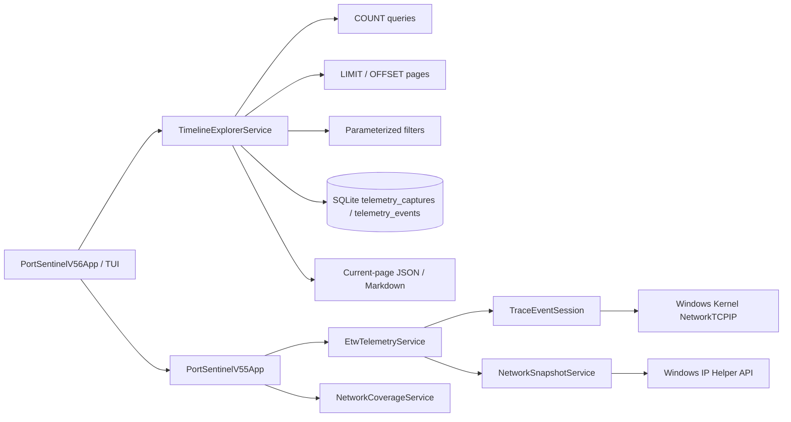

# 🏗️ Архитектура PortSentinel

PortSentinel 0.5.6 добавляет paged query layer поверх существующего read-only ETW pipeline и SQLite telemetry archive. Timeline Explorer читает только текущую страницу capture index или event timeline.



## Timeline query layer

`TimelineExplorerService` не запускает capture и не изменяет сохранённые events. Он работает поверх существующих таблиц.

### Capture index

1. `COUNT(*)` определяет общее число captures;
2. page number ограничивается реальным диапазоном;
3. header records читаются через `ORDER BY id DESC LIMIT $limit OFFSET $offset`;
4. UI получает только одну `TimelineCapturePage`.

### Event timeline

1. фильтры нормализуются;
2. отдельный count query определяет число matching events;
3. SQLite применяет filter до materialization;
4. текущая page читается по `sequence, id`;
5. UI получает `TimelineEventPage`, а не полный `TelemetryCapture`.

Page size ограничен диапазоном 10–200 и в TUI подстраивается под высоту терминала.

## Filters

Поддерживаются независимые ограничения:

- exact event `kind`;
- exact `protocol` family;
- text search по process name;
- local/remote address;
- local/remote port;
- diagnostic note.

Kind и protocol берутся только из фиксированных UI presets. Text search передаётся через `$search`. Символы `\\`, `%` и `_` экранируются для literal `LIKE` matching.

SQL identifiers и clauses не строятся из пользовательского ввода.

## Sequence jump

`FindSequenceAsync` сначала проверяет, что target event соответствует активному filter. Затем count query с `sequence <= $sequence` вычисляет ordinal matching row:

```text
page  = ((row - 1) / pageSize) + 1
index = (row - 1) % pageSize
```

Полный capture для перехода не загружается.

## Page export

`ExportPageAsync` получает уже отображаемый `TimelineEventPage` и сохраняет только его items. JSON и Markdown содержат:

- capture ID;
- page/page size;
- first/last row;
- total matching events;
- активный filter;
- event metadata;
- privacy boundary.

Экспорт не выполняет скрытый full-archive query.

## SQLite indexes

Версия 0.5.6 создаёт индексы через `CREATE INDEX IF NOT EXISTS`:

- `telemetry_events(capture_id, sequence)`;
- `telemetry_events(capture_id, kind, sequence)`;
- `telemetry_events(capture_id, protocol, sequence)`.

Таблицы, columns и existing records не мигрируются. Индексы совместимы с предыдущими версиями.

## Existing telemetry pipeline

Вложенный `PortSentinelV55App` сохраняет весь функционал Network Coverage:

- TCP4/TCP6 lifecycle callbacks;
- UDP4/UDP6 send/receive callbacks;
- snapshot fallback;
- SQLite archive;
- Connection Health;
- protocol matrix и reports.

Предыдущие Control Centers остаются доступными через вложенные панели.

## Capture boundaries

- capture duration ограничена 3–60 секундами;
- сохраняется максимум 5000 нормализованных events на capture;
- SnapshotFallback является point-in-time table;
- отсутствие события внутри окна не доказывает отсутствие активности вне окна.

## Privacy boundary

PortSentinel работает только с network metadata. Он не собирает и не сохраняет:

- packet payload;
- HTTP body;
- cookies или credentials;
- tokens;
- decrypted TLS content.

## Зависимости

- `.NET 8 / net8.0-windows`;
- `Microsoft.Diagnostics.Tracing.TraceEvent` для ETW controller/parser;
- `Microsoft.Data.Sqlite` для archive и paged queries;
- Windows IP Helper API и Toolhelp32 через P/Invoke.
