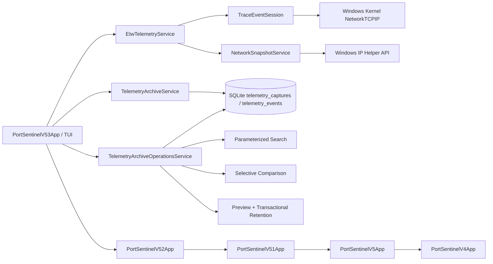

# 🏗️ Архитектура PortSentinel

PortSentinel 0.5.3 разделяет telemetry pipeline на четыре независимых слоя: источник событий, нормализацию capture, долговременный SQLite archive и безопасные операции над архивом.

## Capture backend

`EtwTelemetryService` остаётся владельцем read-only capture и поддерживает kernel ETW TCP IPv4 lifecycle events с автоматическим snapshot fallback через Windows IP Helper API.

В v0.5.3 UI передаёт сервису один из ограниченных profiles: 5, 15, 30 или 60 секунд. Capture backend не знает о persistence и не выполняет SQL.

## Telemetry archive

`TelemetryArchiveService` отвечает только за основную запись и чтение archive:

1. вставляет capture header;
2. вставляет нормализованные event records;
3. сохраняет lifecycle fingerprint;
4. фиксирует capture и events одной транзакцией;
5. экспортирует captures и comparisons в JSON/Markdown.

Существующие `sessions`, `session_entries`, `baselines` и `baseline_entries` не изменяются.

## Archive operations

`TelemetryArchiveOperationsService` добавляет read/query/maintenance сценарии поверх существующей схемы.

### Search

Поиск выполняется через параметры SQLite. Пользовательский текст не конкатенируется с SQL. Query может ограничивать:

- process name;
- local или remote IP address;
- diagnostic note;
- event kind;
- backend mode.

Результаты ограничены максимум 500 последними matching events.

### Selective comparison

Пользователь выбирает две записи из последних 50 captures. Сервис загружает обе через `TelemetryArchiveService`, определяет older/newer по timestamp и применяет тот же lifecycle fingerprint:

- event kind;
- protocol;
- local endpoint;
- remote endpoint;
- process name;
- PID исключён.

Comparison является диагностическим diff и не формирует threat verdict.

### Retention

Retention построен как двухэтапная операция:

1. `PreviewRetentionAsync` рассчитывает число captures/events для удаления и крайнюю дату;
2. UI требует явное подтверждение `Y`;
3. `ApplyRetentionAsync` удаляет старые capture headers в транзакции;
4. связанные events удаляются через `ON DELETE CASCADE`;
5. сохраняются последние 25, 50, 100 или 250 records.

Retention не удаляет обычные sessions, baselines или файлы reports.

## TUI composition

`PortSentinelV53App` предоставляет:

- Capture Profiles;
- Archive Search;
- Selective Comparison;
- Retention Center;
- вложенный Telemetry Archive v0.5.2.

Предыдущие панели сохраняются как вложенные уровни, поэтому v0.5.3 не удаляет ETW capability, Application Watch, DNS correlation, process tree, sessions, baseline, rules или Network Tools.

## Privacy boundary

В archive сохраняются только timestamps, event kinds, process metadata, endpoints и backend limitations. PortSentinel не собирает и не сохраняет packet payload, HTTP body, cookies, credentials, tokens или decrypted TLS content.

## Зависимости

- `.NET 8 / net8.0-windows`;
- `Microsoft.Data.Sqlite` для archive и parameterized operations;
- `Microsoft.Diagnostics.Tracing.TraceEvent` для ETW controller/parser;
- Windows IP Helper API и Toolhelp32 через P/Invoke.
