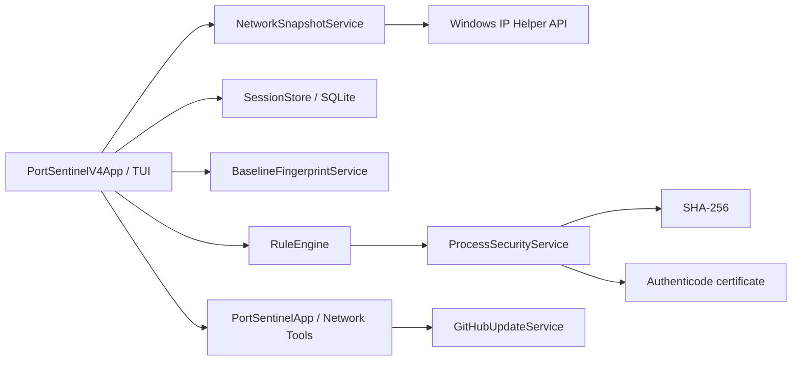

# 🏗️ Архитектура PortSentinel

PortSentinel 0.4.0 состоит из четырёх основных слоёв: Windows telemetry, session storage, baseline/rules и полноэкранная TUI.

## Ответственность компонентов

| Компонент | Ответственность |
|---|---|
| `Program.cs` | Windows check, параметры запуска и сборка dependency graph |
| `PortSentinelV4App` | Главное меню, sessions, baseline и Explainable Rules |
| `PortSentinelApp` | Network Tools предыдущего поколения |
| `NetworkSnapshotService` | TCP/UDP IPv4/IPv6 через `iphlpapi.dll` |
| `SessionStore` | SQLite sessions, baselines и exports |
| `BaselineFingerprintService` | Стабильное сравнение baseline без PID |
| `RuleEngine` | Детерминированные explainable rules |
| `ProcessSecurityService` | SHA-256 и Authenticode metadata |
| `Terminal` | Рендеринг, цвета, рамки, spinner и progress |
| `GitHubUpdateService` | Release API, ZIP, SHA-256 и перезапуск |

## Стабильный baseline fingerprint

Обычный live identity включает PID и подходит для сравнения последовательных снимков. Baseline fingerprint использует protocol, endpoints, process path/name и state, но не PID. Поэтому штатный перезапуск процесса не создаёт ложный новый listener только из-за нового PID.

Старые baseline из v0.3.0 остаются совместимыми: fingerprint вычисляется из сохранённых полей `baseline_entries`, миграция схемы SQLite не требуется.

## Rule engine

v0.4.0 содержит четыре правила:

1. новый listener относительно baseline;
2. wildcard listener;
3. executable без Authenticode;
4. executable из Temp или Downloads.

Каждый `RuleFinding` хранит:

- rule id;
- severity;
- confidence;
- evidence;
- limitation;
- связанную `NetworkEntry`;
- optional SHA-256, signature status и publisher.

Rule engine не формирует malware verdict.

## Enrichment

`ProcessSecurityService` работает локально:

1. группирует уникальные executable paths;
2. рассчитывает SHA-256 с безопасным shared-read;
3. читает Authenticode certificate;
4. сохраняет publisher или явное limitation;
5. не отправляет hashes, paths или telemetry во внешние сервисы.

Наличие сертификата не означает полную проверку цепочки доверия. Это ограничение явно показывается в UI.

## Хранилище и приватность

SQLite расположен в `%LocalAppData%\PortSentinel\portsentinel.db` и использует WAL. Отчёты сохраняются в `%LocalAppData%\PortSentinel\reports`.

PortSentinel не сохраняет payload, HTTP body, cookies, токены или расшифрованное TLS-содержимое.
