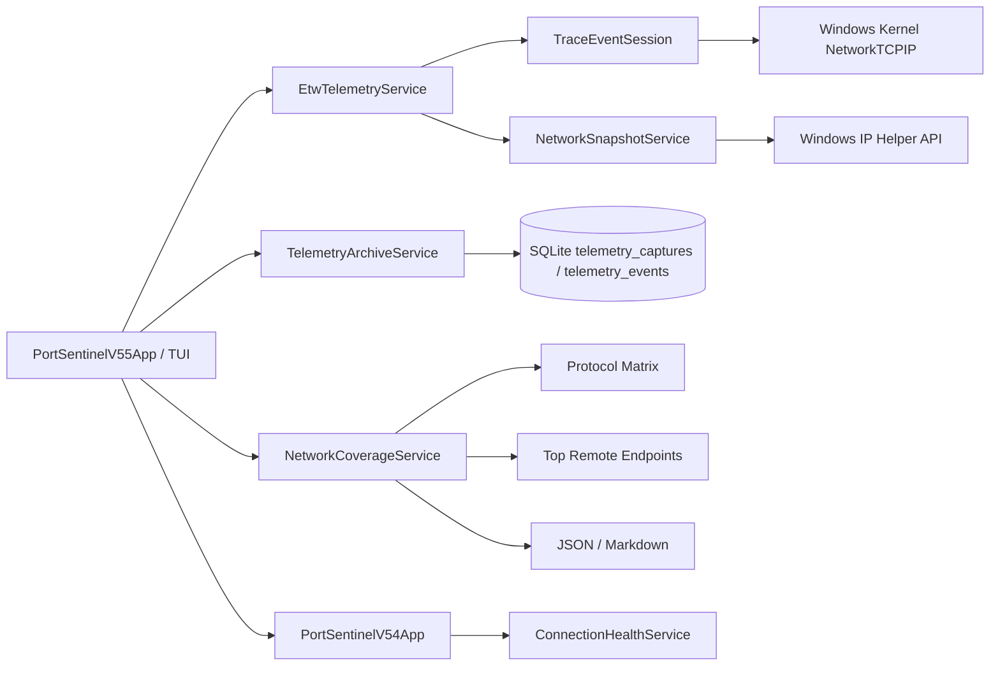

# 🏗️ Архитектура PortSentinel

PortSentinel 0.5.5 расширяет read-only kernel ETW pipeline до TCP/UDP IPv4/IPv6 и добавляет независимый coverage-анализ поверх существующего SQLite telemetry archive.

## Kernel ETW coverage

`EtwTelemetryService` подписывается на следующие группы callbacks.

### TCP IPv4

- `TcpIpConnect`;
- `TcpIpAccept`;
- `TcpIpDisconnect`;
- `TcpIpRetransmit`;
- `TcpIpReconnect`;
- `TcpIpFail`.

### TCP IPv6

- `TcpIpConnectIPV6`;
- `TcpIpAcceptIPV6`;
- `TcpIpDisconnectIPV6`;
- `TcpIpRetransmitIPV6`;
- `TcpIpReconnectIPV6`.

### UDP

- `UdpIpSend` и `UdpIpRecv` для IPv4;
- `UdpIpSendIPV6` и `UdpIpRecvIPV6` для IPv6.

События нормализуются в `EtwNetworkEvent` с protocol labels `TCP4`, `TCP6`, `UDP4`, `UDP6`. Payload не читается.

## Port normalization

TraceEvent parser уже преобразует network-order port fields в host byte order. Версия 0.5.5 удаляет дополнительный `NetworkToHostOrder`, чтобы не выполнять byte-swap дважды. Значение принимается только в диапазоне 0–65535.

UDP callbacks могут не предоставлять source port. В нормализованном event недоступный port равен `0`, а `note` содержит явное limitation.

## Network Coverage analyzer

`NetworkCoverageService` не запускает ETW и не изменяет SQLite. Он принимает `EtwCaptureResult` или сохранённый `TelemetryCapture` и рассчитывает:

- количество IPv4/IPv6 events;
- количество TCP/UDP events;
- UDP send/receive counts;
- protocol matrix по family;
- unique processes;
- unique remote endpoints;
- top 20 remote endpoints;
- список limitations.

Отчёт показывает только наблюдённые events. Отсутствие family не интерпретируется как доказательство отсутствия трафика.

## Archive compatibility

Схема SQLite не изменяется. Таблица `telemetry_events` уже хранит универсальные поля `kind`, `protocol`, addresses, ports и `note`, поэтому новые kinds `UDP_SEND`/`UDP_RECV` и protocols `TCP6`/`UDP4`/`UDP6` сохраняются без migration.

Существующие captures, sessions, baselines и reports остаются совместимыми.

## TUI composition

`PortSentinelV55App` предоставляет:

- Coverage Capture;
- Latest Coverage;
- Archive Coverage;
- protocol details;
- top endpoints;
- limitations;
- JSON/Markdown export;
- вложенный Connection Health v0.5.4.

Предыдущие Control Centers остаются доступными через вложенные панели.

## Capture boundaries

- capture duration ограничена 3–60 секундами;
- UI v0.5.5 использует 15-секундный coverage profile;
- сохраняется максимум 5000 нормализованных events;
- SnapshotFallback является point-in-time table и не предоставляет UDP send/receive ordering;
- отсутствие события внутри окна не доказывает отсутствие активности вне окна.

## Privacy boundary

PortSentinel работает только с network metadata. Он не собирает и не сохраняет:

- packet payload;
- HTTP body;
- cookies или credentials;
- tokens;
- decrypted TLS content.

## Зависимости

- `.NET 8 / net8.0-windows`;
- `Microsoft.Diagnostics.Tracing.TraceEvent` для ETW controller/parser;
- `Microsoft.Data.Sqlite` для local archive;
- Windows IP Helper API и Toolhelp32 через P/Invoke.
