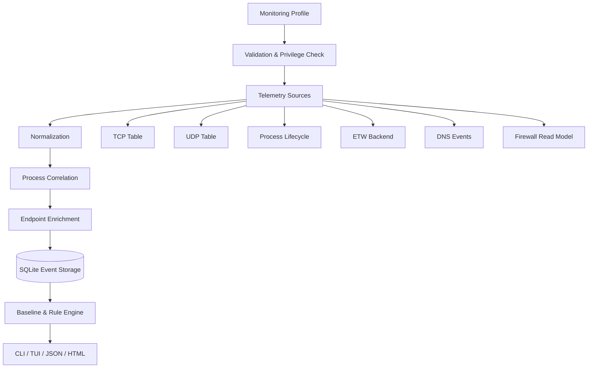
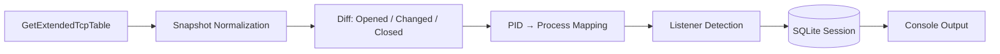

# 🏗️ Архитектура PortSentinel

> Документ описывает целевую архитектуру. Реализация находится на ранней стадии.

## Цели архитектуры

PortSentinel должен быть расширяемой Windows-платформой, а не оболочкой над локализованным выводом `netstat` или `Get-NetTCPConnection`. Основные цели: структурированные источники данных, корректная process identity, объяснимые findings, устойчивое хранение и безопасные системные действия.

## Поток данных



## Проекты solution

| Проект | Ответственность |
|---|---|
| `PortSentinel.Domain` | Immutable domain models, enums, events, findings, endpoints и identities |
| `PortSentinel.Core` | Session Engine, Monitoring Coordinator, Correlation, Baseline, Rules и Privacy |
| `PortSentinel.Windows` | P/Invoke, IP Helper API, WinTrust, Firewall API, ETW, privileges и SafeHandle |
| `PortSentinel.Sources` | TCP/UDP/process/DNS/interface/firewall/event-log sources |
| `PortSentinel.Enrichment` | Signatures, hashing, DNS, endpoint scope и firewall correlation |
| `PortSentinel.Rules` | Side-effect-free explainable detection rules |
| `PortSentinel.Storage` | SQLite, migrations, repositories, batching и paging |
| `PortSentinel.Reporting` | Console, HTML, JSON, Markdown и charts |
| `PortSentinel.Cli` | System.CommandLine, Spectre.Console, TUI, filters и exit codes |

## Source contract

Каждый источник должен иметь собственный lifecycle, capability flags и диагностический результат. Ошибка одного backend не должна останавливать всю сессию.

```csharp
public interface INetworkTelemetrySource
{
    string Id { get; }
    string DisplayName { get; }
    NetworkSourceCapabilities Capabilities { get; }

    Task<NetworkSourceStartResult> StartAsync(
        NetworkMonitoringContext context,
        INetworkEventSink sink,
        CancellationToken cancellationToken);

    Task<NetworkSourceStopResult> StopAsync(
        CancellationToken cancellationToken);
}
```

Источник сообщает backend, event count, dropped events, polling interval, warnings, errors, administrator requirement и limitations.

## Process identity

PID может переиспользоваться Windows, поэтому долговременная identity должна учитывать время запуска:

```text
process://<pid>/<start-time>
```

В metadata планируется хранить PID, parent PID, process name, path, start time, architecture, session ID, integrity level, publisher, signature, version и service/package association. Command line собирается только по явной настройке.

## Connection identity

TCP connection внутри сессии:

```text
tcp://<process-identity>/<local-address>:<local-port>/<remote-address>:<remote-port>/<first-seen>
```

Listener:

```text
listener://<process-identity>/<protocol>/<local-address>:<local-port>/<first-seen>
```

Для UDP нельзя создавать вымышленный remote endpoint.

## Первый vertical slice

Первая рабочая реализация должна включать только необходимый end-to-end путь:



Критерии:

1. TCP IPv4/IPv6 таблицы читаются через структурированный Windows API.
2. Порядок строк не создаёт ложные события.
3. PID корректно связывается с process identity.
4. Listeners определяются и сохраняются.
5. Сессия закрывается без повреждения SQLite после `Ctrl+C`.
6. Частичные данные и ограничения отображаются пользователю.

## Storage

Основные таблицы: `Sessions`, `SessionSources`, `Processes`, `NetworkEvents`, `Connections`, `Listeners`, `Findings`, `Baselines`, `FirewallTransactions`, `ManagedFirewallRules`, `Reports` и `MigrationHistory`.

Обязательны transactions, prepared statements, batch inserts, migrations, paging и индексы по session/timestamp, process identity, PID, protocol/ports, remote address и severity.

## Rule Engine

Rules должны быть versioned, explainable, configurable, testable и side-effect free. Finding содержит severity, confidence, причины, supporting event IDs, рекомендации и ограничения.

Первые правила:

- `NewListenerRule`;
- `WildcardListenerRule`;
- `UnsignedNetworkProcessRule`;
- `TempDirectoryNetworkProcessRule`.

## Надёжность

- bounded channels и backpressure;
- приоритет lifecycle/listener events;
- ограниченный hashing parallelism;
- rate-limited DNS;
- dropped-events counter;
- graceful fallback при недоступном ETW;
- crash recovery для незавершённых сессий;
- warnings собственного кода считаются errors.
