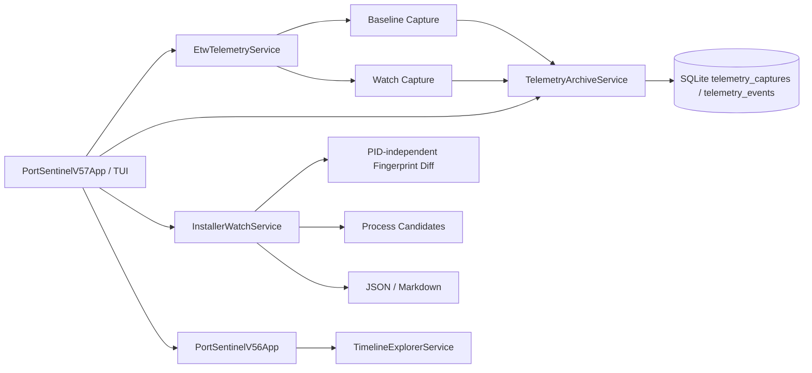

# 🏗️ Архитектура PortSentinel

PortSentinel 0.5.7 добавляет guided Installer Watch поверх существующего read-only ETW pipeline, SQLite archive и Timeline Explorer. Новый слой не запускает installer EXE и не изменяет систему.

## Guided workflow

`PortSentinelV57App` реализует два профиля:

- Standard Watch: baseline 8 секунд и watch 30 секунд;
- Deep Watch: baseline 10 секунд и watch 60 секунд.

Порядок выполнения:

1. пользователь записывает baseline без установщика;
2. baseline немедленно сохраняется через `TelemetryArchiveService`;
3. PortSentinel останавливается в ручной checkpoint;
4. пользователь самостоятельно запускает installer EXE;
5. после Enter начинается watch capture;
6. watch capture сохраняется в ту же SQLite schema;
7. `InstallerWatchService` строит before/after report.

PortSentinel не получает путь к установщику, не вызывает `Process.Start` и не выполняет package-manager commands.

## Fingerprint comparison

Analyzer строит baseline set и выбирает watch events, fingerprint которых ранее не наблюдался.

Для outbound metadata fingerprint включает:

- event kind;
- protocol family;
- normalized process name;
- remote address;
- remote port.

PID и outbound local ephemeral port исключаются, чтобы process restart или новый временный port не создавали ожидаемый шум.

Для `LISTENER` и `ACCEPT` дополнительно сохраняются local address и local port, потому что binding является значимой частью наблюдения.

Added events дедуплицируются по fingerprint и сортируются так, чтобы process-hint matches отображались первыми.

## Process candidates

Новые events группируются по normalized process name. Для каждого кандидата рассчитываются:

- added event count;
- unique remote endpoints;
- TCP event count;
- UDP event count;
- число `FAIL`, `RETRANSMIT` и `RECONNECT` signals;
- совпадение с optional process hint.

Process hint используется только для prioritization. Он не изменяет fingerprints, не скрывает остальные processes и не создаёт attribution verdict.

## Archive compatibility

Версия 0.5.7 не добавляет таблицы или columns. Baseline и watch являются обычными `telemetry_captures`, а events записываются в существующую `telemetry_events`.

Это позволяет:

- открыть обе captures в Timeline Explorer;
- повторно построить report через Latest Pair;
- применять archive search и retention;
- сохранить backward compatibility с предыдущими records.

## Reports

`InstallerWatchService.ExportAsync` создаёт:

- JSON schema v1 с capture IDs, backends, process candidates, added events и limitations;
- Markdown report с process table и added network metadata.

Reports сохраняются в существующий `%LocalAppData%\PortSentinel\reports`.

## Trust boundaries

Installer Watch всегда сообщает следующие ограничения:

- baseline и watch являются отдельными bounded captures;
- промежуток между ними не записывается;
- background applications, services и scheduled tasks могут создать новые events;
- installer может делегировать network activity child process, service host, package manager или browser;
- process-name correlation не доказывает ownership;
- SnapshotFallback может пропустить short-lived lifecycle events и ordering.

## Existing layers

Вложенный `PortSentinelV56App` сохраняет:

- server-side Timeline Explorer pagination;
- kind/protocol filters и sequence jump;
- Network Coverage TCP4/TCP6/UDP4/UDP6;
- Connection Health;
- archive search, comparison и retention;
- sessions, baseline rules и legacy network tools.

## Privacy boundary

PortSentinel работает только с network metadata. Он не собирает и не сохраняет:

- packet payload;
- HTTP body;
- cookies или credentials;
- tokens;
- decrypted TLS content.

## Зависимости

- `.NET 8 / net8.0-windows`;
- `Microsoft.Diagnostics.Tracing.TraceEvent` для ETW controller/parser;
- `Microsoft.Data.Sqlite` для local archive и timeline queries;
- Windows IP Helper API и Toolhelp32 через P/Invoke.
