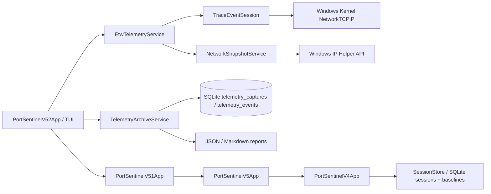

# 🏗️ Архитектура PortSentinel

PortSentinel 0.5.2 разделяет telemetry pipeline на три независимых слоя: источник событий, нормализацию capture и долговременный SQLite archive.

## Capture backend

`EtwTelemetryService` остаётся владельцем read-only capture:

- kernel ETW TCP IPv4 connect;
- accept;
- disconnect;
- retransmit;
- автоматический snapshot fallback через Windows IP Helper API.

Сервис возвращает `EtwCaptureResult` и не знает, будет ли результат сохранён. Это позволяет использовать capture как одноразово в старой панели v0.5.1, так и с persistence в v0.5.2.

## Telemetry archive

`TelemetryArchiveService` получает готовый `EtwCaptureResult` и выполняет транзакцию:

1. вставляет header в `telemetry_captures`;
2. вставляет нормализованные события в `telemetry_events`;
3. сохраняет backend mode, counters, elevated status и fallback reason;
4. фиксирует транзакцию только после записи всех событий.

Таблицы создаются через `CREATE TABLE IF NOT EXISTS`. Существующие `sessions`, `session_entries`, `baselines` и `baseline_entries` не изменяются.

## Схема archive

`telemetry_captures` хранит:

- timestamps начала и окончания;
- `KernelEtw` или `SnapshotFallback`;
- status и failure reason;
- event/connect/accept/disconnect/retransmit counters;
- elevated flag.

`telemetry_events` хранит:

- sequence и timestamp;
- event kind;
- PID и process name;
- protocol и endpoints;
- диагностическую note;
- lifecycle fingerprint.

## Lifecycle comparison

Fingerprint строится из:

- event kind;
- protocol;
- local endpoint;
- remote endpoint;
- process name.

PID намеренно исключён. Поэтому штатный перезапуск процесса не считается самостоятельным lifecycle deviation. `CompareLatestAsync` строит множества fingerprints двух последних captures и возвращает новые события и исчезнувшие fingerprints.

Comparison является диагностическим diff и не формирует threat или malware verdict.

## TUI composition

`PortSentinelV52App` предоставляет:

- Capture & Archive;
- Telemetry History;
- Capture Comparison;
- вложенный ETW Control Center v0.5.1.

Предыдущие панели остаются доступными как вложенные уровни, поэтому новая версия не удаляет Application Watch, DNS correlation, process tree, sessions, baseline, rules и Network Tools.

## Privacy boundary

В archive сохраняются только timestamps, event kinds, process metadata, endpoints и backend limitations. PortSentinel не собирает и не сохраняет:

- packet payload;
- HTTP body;
- cookies или credentials;
- tokens;
- decrypted TLS content.

Reports записываются в `%LocalAppData%\PortSentinel\reports`, база — в `%LocalAppData%\PortSentinel\portsentinel.db`.

## Зависимости

- `.NET 8 / net8.0-windows`;
- `Microsoft.Data.Sqlite` для локального archive;
- `Microsoft.Diagnostics.Tracing.TraceEvent` для ETW controller/parser;
- Windows IP Helper API и Toolhelp32 через P/Invoke.
