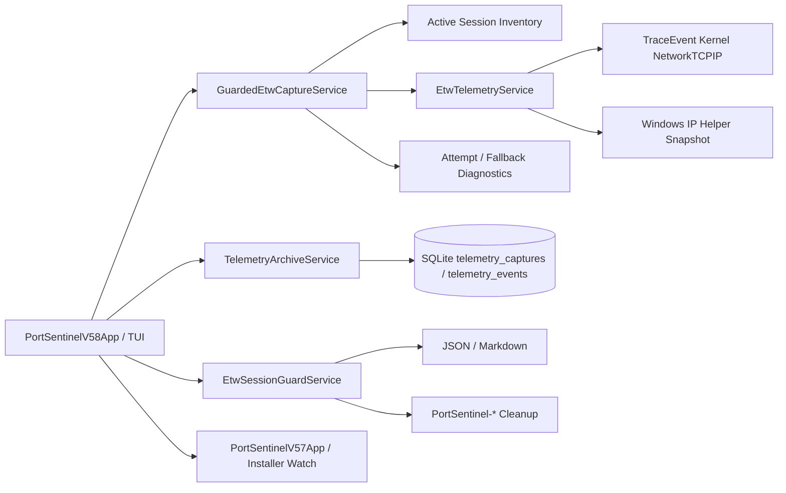

# 🏗️ Архитектура PortSentinel

PortSentinel 0.5.8 добавляет ETW Session Guard поверх существующего read-only capture pipeline. Новый слой выполняет preflight inventory, сохраняет диагностику backend/fallback и предоставляет отдельный owned-only cleanup для orphan sessions.

## Session inventory

`EtwSessionGuardService.Inspect` вызывает `TraceEventSession.GetActiveSessionNames()` и получает только имена активных ETW logger sessions.

Результат содержит:

- timestamp inventory;
- success/error status;
- полный список session names;
- subset имён с префиксом `PortSentinel-`;
- owned/foreign counters.

Inventory не attach-ится к foreign sessions, не читает provider payload и не изменяет logger configuration.

## Guarded capture

`GuardedEtwCaptureService` выполняет следующий workflow:

1. получает inventory до capture;
2. вызывает существующий bounded `EtwTelemetryService.CaptureAsync`;
3. фиксирует backend, duration, failure text и session counts;
4. классифицирует fallback best-effort способом;
5. только при вероятном name collision выполняет один retry после короткой задержки;
6. возвращает `EtwGuardedCaptureResult`;
7. UI сохраняет обычный `EtwCaptureResult` в существующий SQLite archive.

Классификация включает:

- `NotElevated`;
- `AccessDenied`;
- `NameCollision`;
- `ResourceLimit`;
- `SessionUnavailable`;
- `Unknown`.

Она является диагностической. Неизвестные сообщения не получают speculative interpretation.

## Foreign-session protection

Guarded Capture не вызывает stop/restart для session names из inventory. Сторонние ETW sessions только отображаются в отчёте.

Foreign-session policy:

- no automatic attach;
- no automatic stop;
- no restart;
- no provider changes;
- no logger-limit changes.

## Owned cleanup

`CleanupOwnedAsync` сначала фильтрует input через `IsOwnedSession`. Только имена, начинающиеся с `PortSentinel-`, могут пройти к `TraceEventSession.GetActiveSession` и `Stop(noThrow: true)`.

TUI дополнительно требует:

1. dry-run preview;
2. предупреждение о других экземплярах PortSentinel;
3. подтверждение клавишей `Y`.

Если session исчезла между preview и cleanup, операция считается завершённой без ошибки. Foreign names отбрасываются до attach.

## Reports

Session Guard создаёт два типа отчётов:

- inventory JSON schema v1 / Markdown;
- guarded-capture diagnostics JSON schema v1 / Markdown.

Diagnostics содержат capture summary, попытки, failure kind, optional native code, inventory counters и foreign-session policy. Network events отдельно сохраняются в обычном telemetry archive.

## Archive compatibility

Версия 0.5.8 не меняет SQLite schema. Guarded Capture сохраняется как обычная запись `telemetry_captures` и связанные `telemetry_events`.

Поэтому результат доступен в:

- Timeline Explorer;
- Network Coverage;
- Connection Health;
- archive search/comparison;
- retention operations.

## Existing layers

Вложенный `PortSentinelV57App` сохраняет:

- Installer Watch baseline/watch workflow;
- Timeline Explorer pagination;
- TCP4/TCP6/UDP4/UDP6 coverage;
- Connection Health;
- archive operations;
- sessions, explainable rules и legacy network tools.

## Privacy boundary

PortSentinel работает только с session names и network metadata. Он не собирает и не сохраняет:

- packet payload;
- HTTP body;
- cookies или credentials;
- tokens;
- decrypted TLS content.

## Зависимости

- `.NET 8 / net8.0-windows`;
- `Microsoft.Diagnostics.Tracing.TraceEvent` для ETW controller/parser и session inventory;
- `Microsoft.Data.Sqlite` для local archive;
- Windows IP Helper API и Toolhelp32 через P/Invoke.
