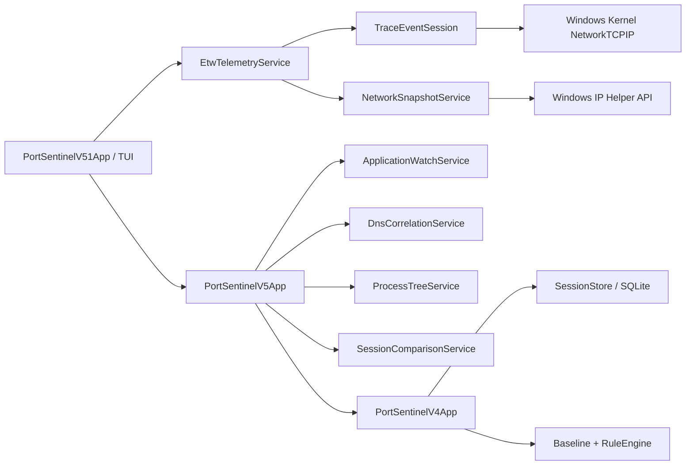

# 🏗️ Архитектура PortSentinel

PortSentinel 0.5.1 использует два взаимозаменяемых источника сетевой telemetry: kernel ETW для событий жизненного цикла TCP и Windows IP Helper API для стабильных snapshots и fallback.

## ETW backend

`EtwTelemetryService` создаёт ограниченную real-time `TraceEventSession`, подписывается на kernel `NetworkTCPIP` events и останавливает session после заданного окна.

Первый vertical slice обрабатывает:

- TCP IPv4 connect;
- TCP IPv4 accept;
- TCP IPv4 disconnect;
- TCP IPv4 retransmit.

Событие нормализуется в `EtwNetworkEvent`: timestamp, kind, PID, process name, protocol, local endpoint, remote endpoint и диагностическая note.

## Capability и fallback

Перед capture выполняется capability probe:

1. проверяется Windows;
2. определяется elevated token;
3. при наличии прав запускается kernel ETW;
4. при отказе доступа, конфликте logger session или другой ошибке вызывается `NetworkSnapshotService`;
5. UI явно показывает `KernelEtw` или `SnapshotFallback` и причину fallback.

PortSentinel не изменяет членство пользователя в `Performance Log Users`, не отключает сторонние ETW sessions и не меняет системные logger limits.

## Privacy boundary

Backend включает только kernel network event metadata. Packet capture не включается. Приложение не собирает:

- packet payload;
- HTTP body;
- cookies или credentials;
- tokens;
- decrypted TLS content.

JSON/Markdown exports сохраняются в `%LocalAppData%\PortSentinel\reports` и содержат только нормализованную metadata.

## Предыдущие слои

`PortSentinelV5App` остаётся отдельным вложенным Control Center и предоставляет Application Watch, DNS correlation, Network Process Tree и Session Comparison. `PortSentinelV4App` сохраняет SQLite sessions, baseline и Explainable Rules. Старые форматы базы не требуют миграции для v0.5.1.

## Зависимости

- `.NET 8 / net8.0-windows`;
- `Microsoft.Data.Sqlite` для локального storage;
- `Microsoft.Diagnostics.Tracing.TraceEvent` для ETW controller/parser;
- Windows IP Helper API и Toolhelp32 через P/Invoke.
