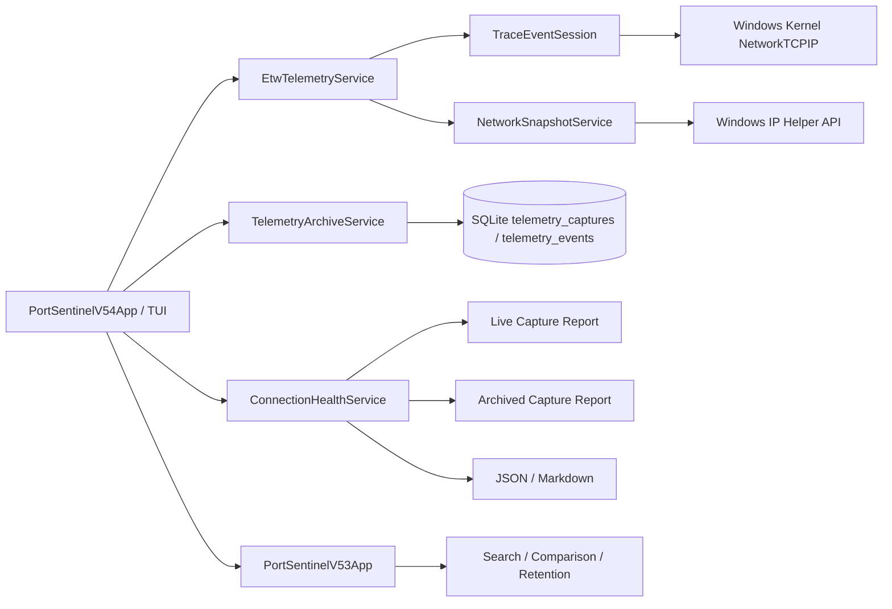

# 🏗️ Архитектура PortSentinel

PortSentinel 0.5.4 добавляет explainable Connection Health поверх существующего read-only ETW pipeline и SQLite telemetry archive.

## ETW lifecycle coverage

`EtwTelemetryService` подписывается на:

- `TcpIpConnect`;
- `TcpIpAccept`;
- `TcpIpDisconnect`;
- `TcpIpRetransmit`;
- `TcpIpReconnect`;
- `TcpIpFail`.

Connect, accept, disconnect, retransmit и reconnect нормализуются с process/endpoints. `TcpIpFailTraceData` предоставляет protocol и numeric failure code, но не endpoint. Поэтому FAIL event хранится без endpoint и с исходным numeric evidence.

PortSentinel не назначает undocumented failure codes человеческим значениям. Mapping может быть добавлен только при наличии authoritative таблицы.

## Connection Health analyzer

`ConnectionHealthService` не управляет ETW и не изменяет archive. Он получает `EtwCaptureResult` или `TelemetryCapture` и применяет deterministic rules:

1. `PS-HEALTH-001` — kernel TCP fail events;
2. `PS-HEALTH-002` — три и более retransmits для process/remote endpoint;
3. `PS-HEALTH-003` — два и более reconnects для process/remote endpoint;
4. `PS-HEALTH-004` — шесть и более connects для process/remote endpoint;
5. `PS-HEALTH-005` — disconnect без connect/reconnect внутри capture window;
6. `PS-HEALTH-006` — limitation SnapshotFallback.

Каждый finding содержит severity, confidence, evidence, limitation, process, remote endpoint и count.

## Health score

Score начинается со 100 и получает bounded penalty:

- High: −25;
- Medium: −12;
- Low: −5;
- Info: 0.

Результат ограничен диапазоном 0–100:

- 90–100 — Stable;
- 70–89 — Observe;
- 40–69 — Degraded;
- 0–39 — Critical.

Score является UI summary и не формирует malware, ownership или security verdict.

## Capture boundaries

ETW capture ограничен выбранным окном. Disconnect может относиться к соединению, созданному до начала наблюдения. Отсутствие findings не доказывает здоровье системы за пределами capture window.

В SnapshotFallback отсутствуют kernel fail/reconnect/retransmit events, поэтому analyzer добавляет явное limitation вместо ложного вывода.

## Archive compatibility

Новые event kinds сохраняются существующим `TelemetryArchiveService` без изменения схемы: `kind`, `protocol`, `note` и endpoints уже являются универсальными полями. FAIL records используют пустые endpoints, которые UI показывает как `—`.

Существующие sessions, baselines, archive records и exports остаются совместимыми.

## Privacy boundary

PortSentinel работает только с network metadata. Он не собирает и не сохраняет:

- packet payload;
- HTTP body;
- cookies или credentials;
- tokens;
- decrypted TLS content.

## Зависимости

- `.NET 8 / net8.0-windows`;
- `Microsoft.Diagnostics.Tracing.TraceEvent` для ETW controller/parser;
- `Microsoft.Data.Sqlite` для local archive;
- Windows IP Helper API и Toolhelp32 через P/Invoke.
