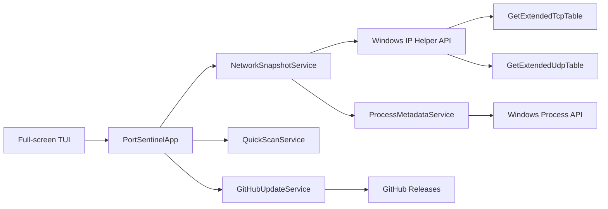

# 🏗️ Архитектура PortSentinel

Документ разделяет **реализованное ядро v0.2.0** и будущие подсистемы. PortSentinel уже является самостоятельным `portsentinel.exe` с собственной полноэкранной TUI-панелью.

## Архитектура v0.2.0

## Ответственность компонентов

| Компонент | Ответственность |
|---|---|
| `Program.cs` | Windows check, параметры запуска, UTF-8 и создание приложения |
| `PortSentinelApp` | Навигация, экраны, live loop и управление клавиатурой |
| `Terminal` | Полноэкранный рендеринг, цвета, рамки, spinner и progress-анимации |
| `AsciiLogo` | Полный и компактный символьный логотип |
| `NetworkSnapshotService` | TCP/UDP IPv4/IPv6 таблицы через `iphlpapi.dll` |
| `ProcessMetadataService` | PID, имя процесса, executable path, компания и start time |
| `QuickScanService` | Explainable эвристики без malware verdict |
| `GitHubUpdateService` | Release API, ZIP, SHA-256, безопасная распаковка и перезапуск |

## Поток сетевых данных

1. `GetExtendedTcpTable` и `GetExtendedUdpTable` возвращают структурированные Windows-таблицы.
2. Native rows нормализуются в `NetworkEntry`.
3. PID обогащается сведениями о процессе.
4. UI разделяет listeners и active connections.
5. Live Monitor сравнивает последовательные снимки и выделяет новые записи.
6. Quick Scan оценивает только наблюдаемые признаки.

PortSentinel не парсит локализованный вывод `netstat` и не запускает PowerShell для основного мониторинга.

## Native API

v0.2.0 использует:

- `GetExtendedTcpTable` для TCP IPv4/IPv6;
- `GetExtendedUdpTable` для UDP IPv4/IPv6;
- `System.Diagnostics.Process` для process metadata;
- `kernel32.dll` для virtual terminal mode.

Native buffer всегда освобождается через `Marshal.FreeHGlobal`. Ошибка чтения превращается в понятный экран диагностики, а не в повреждённую таблицу.

## TUI

Интерфейс не зависит от внешней UI-библиотеки. Это позволяет выпускать один self-contained EXE и полностью контролировать:

- перерисовку экрана;
- навигацию стрелками;
- цветовые состояния;
- адаптацию таблиц к ширине терминала;
- заставку, spinner и progress bar;
- автоматическое отключение анимаций при redirect.

Подробнее: [`INTERFACE.md`](INTERFACE.md).

## Обновления

Updater доверяет только Release репозитория `Onmaynec/PortSentinel`. Перед установкой он:

1. получает `releases/latest`;
2. ищет ожидаемый `win-x64.zip`;
3. скачивает `.sha256`;
4. сравнивает SHA-256;
5. проверяет пути ZIP при распаковке;
6. просит явное подтверждение;
7. заменяет файлы после завершения текущего процесса.

Подробнее: [`UPDATES.md`](UPDATES.md).

## Следующие архитектурные слои

В следующих версиях будут добавлены отдельные проекты или модули для:

- SQLite session storage;
- baseline engine;
- explainable rule engine;
- digital signature и hashing enrichment;
- ETW и DNS correlation;
- HTML/JSON/Markdown reporting;
- managed Windows Firewall actions с plan, dry-run и rollback.

Эти подсистемы пока являются roadmap и не выдаются документацией за готовую функциональность.
